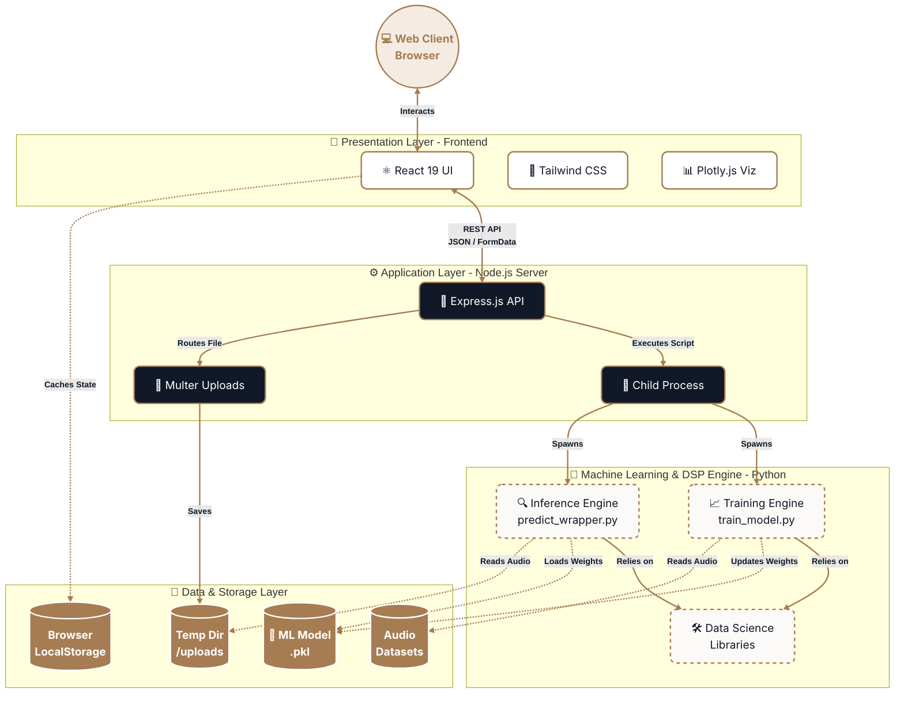

# Audio Verifier - System Architecture

This diagram breaks down the system into a layered architecture to demonstrate how the technologies stack up from the user interface down to the machine learning engine and storage layers.

### Layer Breakdown

1. **Presentation Layer (Frontend):** 
   - A single-page application (SPA) built with **React 19** and bundled with **Vite**. 
   - Styled using **Tailwind CSS**. 
   - Audio waveform and confidence charts are rendered using **Plotly.js**.
   
2. **Application Layer (Backend):**
   - A lightweight **Node.js** server using **Express**. 
   - Middleware like **Multer** handles parsing incoming `multipart/form-data` and storing audio securely.
   - It acts as an API gateway, taking HTTP requests and spawning Python child processes natively through Node's `child_process`.
   
3. **Machine Learning & DSP Engine (Processing):**
   - Isolated **Python** scripts ensure the heavy lifting for Digital Signal Processing (DSP) does not block the Node.js event loop.
   - Consists of two primary modules: `predict_wrapper.py` for live inference and `train_model.py` for retraining. 
   - Relies heavily on underlying data science frameworks (like Scikit-Learn or Librosa).
   
4. **Data & Storage Layer:**
   - **Local Storage:** Browsers cache recent scan histories locally without requiring a remote database.
   - **File System:** Audio datasets for training, temporary user uploads for predicting, and the serialized `deepfake_detector.pkl` model weights are strictly managed on the local file system.
