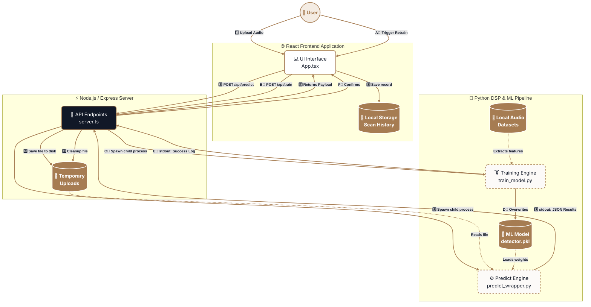

# Audio Verifier - Data Flow Architecture

This visually enhanced diagram illustrates the data flow within the Audio Verifier application, covering both the **Deepfake Analysis** and **Model Retraining** pipelines. 

### Key Upgrades
* **Thematic Colors:** Uses the application's actual color palette (`#A67C52` warm brown accents, `#111827` dark slates, `#F4ECE3` cream backgrounds).
* **Emojis & Icons:** Added visual indicators for better glanceability of nodes.
* **Rounded Corners:** Implemented `rx/ry` curvature on nodes for a modern aesthetic mimicking the app's Tailwind UI corners.
* **Separation of Concerns:** Clear demarcation between data stores (cylinders), standard processing nodes (rectangles), and human actors (circles).
