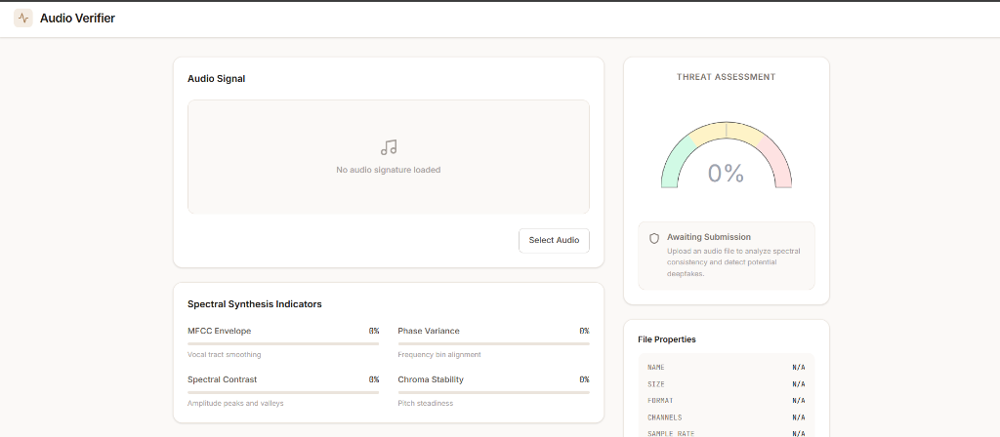
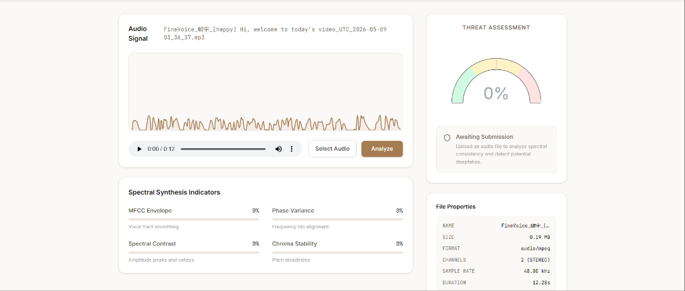
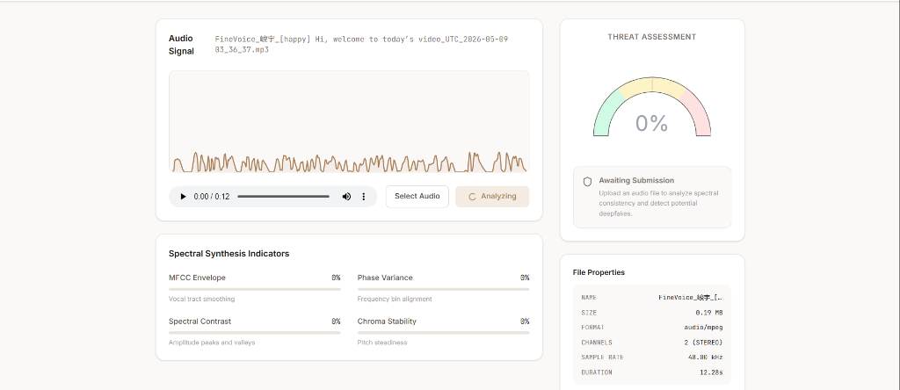
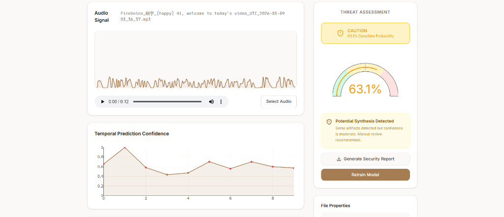
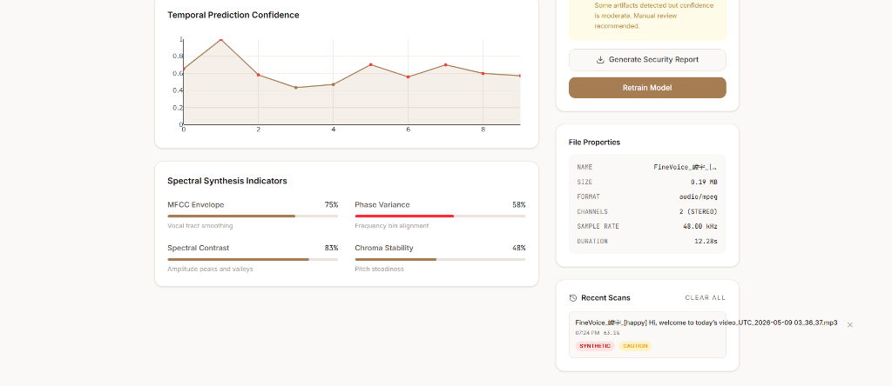

# Audio Verifier (Deepfake Audio Detection)

Audio Verifier is a full-stack application designed to analyze and detect synthetic or deepfake audio. It uses machine learning models and digital signal processing (DSP) heuristics to analyze acoustic features and predict whether an audio file is authentic or synthetically generated.

## Features

- **Audio Upload & Playback:** Upload audio files and listen to them directly within the web app.
- **Deepfake Detection Engine:** Uses a Python-based backend and machine learning to calculate the probability of an audio file being a deepfake.
- **Spectral Analysis Visualization:** View real-time waveforms and detailed spectral analysis metrics, including:
  - MFCC Envelope
  - Phase Variance
  - Spectral Contrast
  - Chroma Stability
- **Threat Assessment:** Provides a visual gauge of confidence levels and a detailed threat assessment summary.
- **Scan History:** Keeps a local record of previously scanned files and their authenticity scores for quick reference.
- **Security Reports:** Generate and download detailed JSON security reports for the analyzed audio.
- **Model Retraining:** Retrain the detection model directly from the UI to improve accuracy over time.

## Screenshots

### Default State


### Audio Loaded & Ready to Analyze


### Analyzing in Progress


### Analysis Results — Threat Assessment


### Detailed Metrics & Scan History


## Technology Stack

- **Frontend:** React 19, TypeScript, Vite, Tailwind CSS (v4), Lucide React, Plotly.js (Data Visualization), Motion (Animations).
- **Backend:** Node.js, Express.js.
- **Machine Learning & DSP:** Python. The backend spawns Python scripts (`predict_wrapper.py`, `train_model.py`) to handle intensive audio processing and inference using a pre-trained model (`deepfake_detector.pkl`).

## Getting Started

### Prerequisites

- Node.js (v18+)
- Python (v3.8+)

### Installation

1. **Install Node Dependencies:**
   ```bash
   npm install
   ```

2. **Python Environment:**
   The Express server will automatically attempt to create a Python virtual environment (`venv`) and install the required dependencies from `requirements.txt` when started. 
   
   If you need to install them manually:
   ```bash
   python -m venv venv
   # Windows: venv\Scripts\activate | Mac/Linux: source venv/bin/activate
   pip install -r requirements.txt
   ```

### Running the Application

To start the development server (which spins up both Vite for the frontend and Express for the API):

```bash
npm run dev
```

The application will be accessible at `http://localhost:3000`.

### Building for Production

```bash
npm run build
npm start
```

## Dataset Generation and Model Training

This project now separates dataset generation from model training.

1. Generate synthetic training data:

```bash
python train_with_realistic_tts.py \
  --regenerate \
  --authentic-samples 120 \
  --tts-samples 120 \
  --duration 3.0 \
  --authentic-dir training_audio/authentic_realistic \
  --tts-dir training_audio/tts_deepfake
```

This will create:
- `training_audio/authentic_realistic/` — synthetic authentic-like samples
- `training_audio/tts_deepfake/` — generated TTS deepfake samples
- `training_audio/generation_metadata.json` — dataset generation metadata

2. Train the detector model:

```bash
python train_model.py \
  --authentic-dirs audio_data/authentic,authentic_audio \
  --synthetic-dirs audio_data/synthetic,synthetic_audio \
  --generated-authentic-dirs training_audio/authentic_realistic \
  --generated-synthetic-dirs training_audio/tts_deepfake \
  --model-output deepfake_detector.pkl \
  --metadata-output training_metadata.json \
  --force \
  --timestamped
```

This will save:
- `deepfake_detector.pkl` — model used by the app
- `training_metadata.json` — training metadata, evaluation metrics, and source directories
- optional timestamped model copy when `--timestamped` is used

### Notes

- `training_audio/authentic_realistic` is generated synthetic "authentic-like" audio. It is not a substitute for actual recorded human voice data.
- For best results, include real authentic recordings in `audio_data/authentic` or `authentic_audio`.
- Include real TTS/deepfake samples in `audio_data/synthetic` or `synthetic_audio`.
- The separation of generation and training makes it easier to compare:
  - generated realistic audio
  - real human audio
  - real synthetic / TTS audio

## Project Structure

- `src/`: React frontend source code, main interface in `App.tsx`.
- `server.ts`: Express server handling file uploads, API routes, and Python child processes.
- `predict_wrapper.py`: Script that performs the actual inference on the uploaded audio.
- `train_model.py`: Script used for retraining the machine learning model.
- `deepfake_detector.pkl`: The saved machine learning model.
- `requirements.txt`: Python dependencies.
- `package.json`: Node dependencies and project scripts.
- `screenshots/`: Application screenshots for documentation.
- Dataset folders (`audio_data/`, `training_data/`, `synthetic_audio/`, `authentic_audio/`): Used for training and validating the model.
