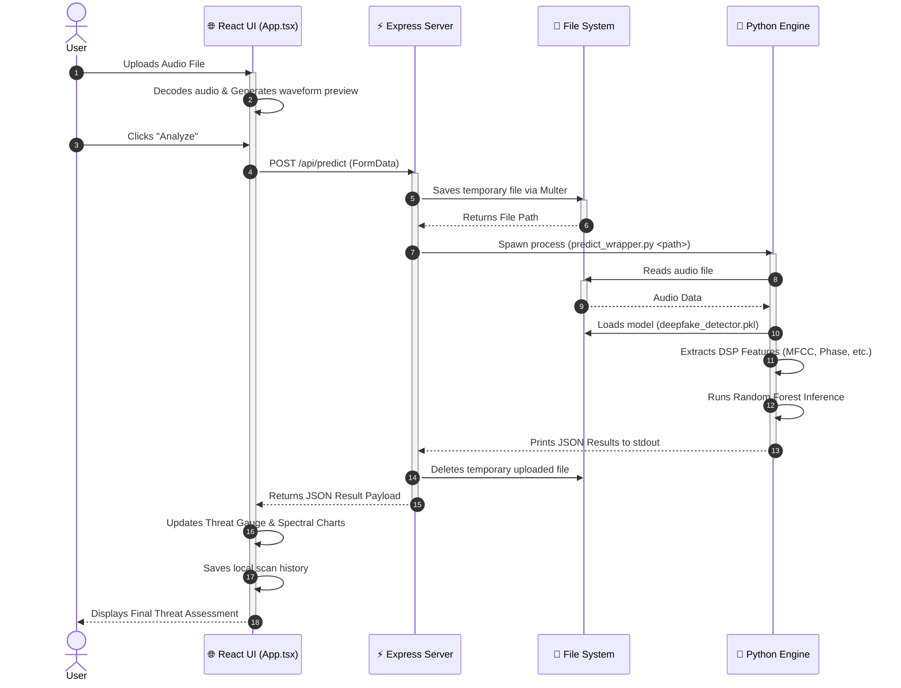

# Audio Verifier - Sequence Diagram

This sequence diagram illustrates the step-by-step chronological interactions between the user, the frontend, the backend, the file system, and the Python machine learning engine during the core **Deepfake Prediction** workflow.

### Flow Explanation
1. The user provides an audio file. The React UI instantly decodes it in the browser to show a waveform.
2. The user initiates the analysis, sending the file to the Node.js Express server.
3. The server temporarily saves the file and invokes a Python child process.
4. Python reads the audio, loads the pre-trained model, calculates acoustic features, and executes inference.
5. The result is passed back to Node.js via `stdout`.
6. Node.js cleans up the filesystem and sends the final JSON payload back to the React client for rendering.
